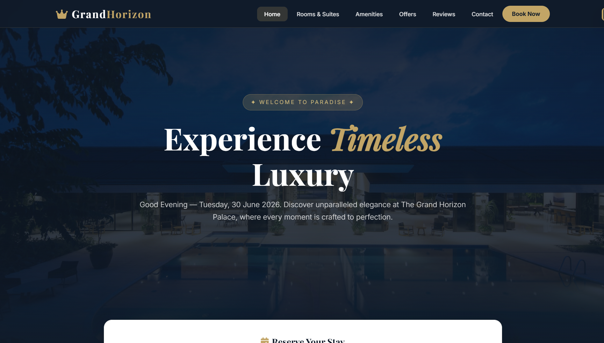
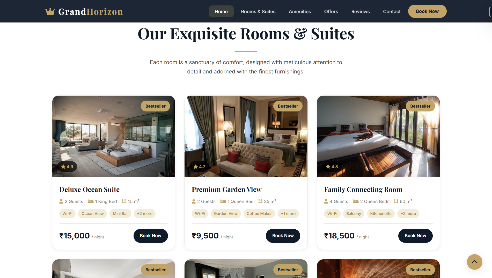
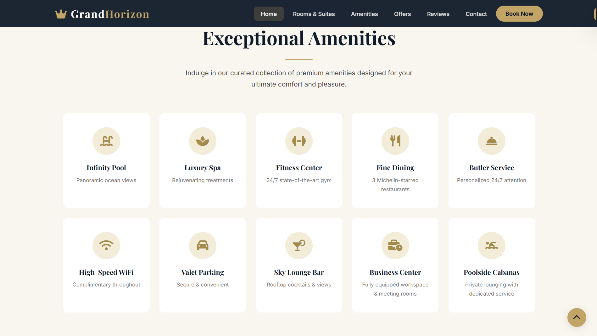
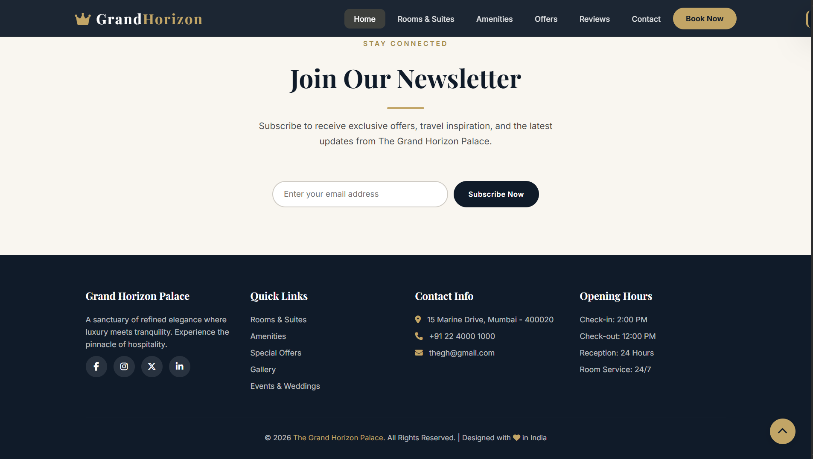

# 🏨 The Grand Horizon Palace – Hotel Management System Homepage

A luxury hotel homepage built with PHP, HTML, CSS, and JavaScript.  
It includes dynamic room listings, a booking inquiry form, special offers, testimonials, newsletter subscription, and responsive design.

---

## 📸 Screenshots

| Homepage Hero | Rooms & Suites |
|--------------|----------------|
|  |  |

| Mobile Navigation | Newsletter Modal |
|-------------------|------------------|
|  |  |

---

## ✨ Key Features

- Dynamic content from PHP arrays (rooms, offers, testimonials)  
- Booking form with server-side validation  
- Fully responsive (mobile dropdown menu)  
- Copy-to-clipboard promo codes  
- Newsletter modal with email validation  
- Smooth scrolling and toast notifications  
- Back‑to‑top button and CSS animations  
- Custom theme variables for easy color changes  

---

## 🛠️ Tech Stack

| Layer      | Technology |
|------------|------------|
| Backend    | PHP 7+     |
| Frontend   | HTML5, CSS3 (grid, flexbox, custom properties), Vanilla JavaScript |
| Icons      | Font Awesome 6.5.1 |
| Fonts      | Google Fonts (Playfair Display, Inter) |
| Images     | Unsplash |
---
## 📁 Project Files
project/
├── index.php # Homepage
├── header.php # Common header (included by all pages)
├── footer.php # Common footer (included by all pages)
├── indexpage.css # Main stylesheet
├── indexpage.js # JavaScript
├── rooms.php # Rooms page (example)
├── amenities.php # Amenities page (example)
├── offers.php # Offers page (example)
├── testimonials.php # Reviews page (example)
├── contact.php # Contact page (example)
└── README.md
---
